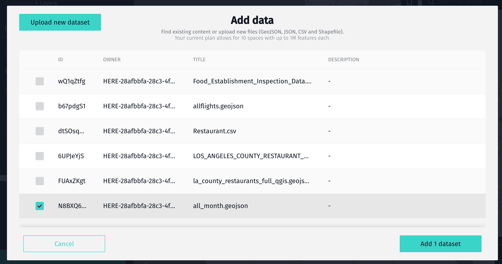
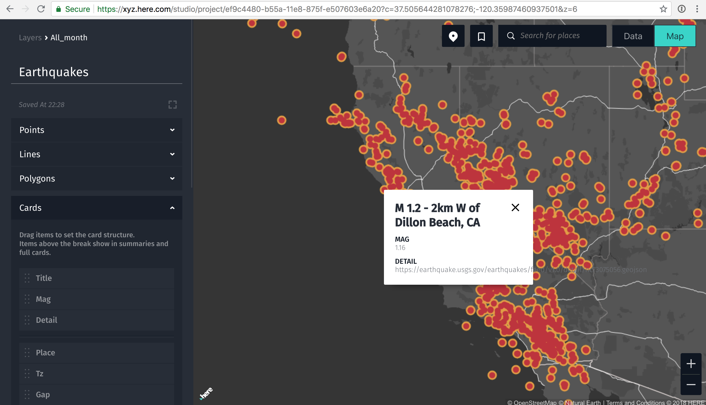
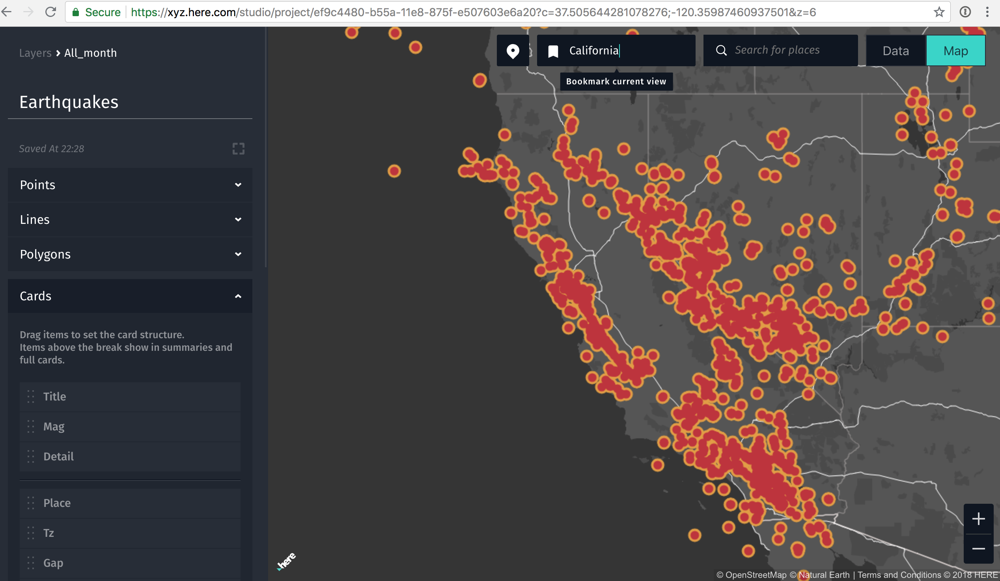
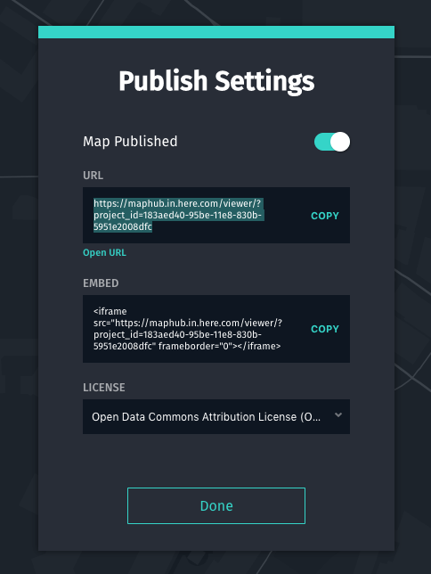

author: Stamen Design
summary: Make a map in XYZ Studio
id: 1
categories: map
environments: js
status: draft
feedback link: https://github.com/here-xyz-codelabs/here-xyz-codelabs.github.io/issues
analytics account: 0

# Make a map in XYZ Studio

## Introduction

This tutorial shows you how to create a simple map in XYZ studio.

### What you'll learn
* The basics of XYZ Studio
* How to upload a GeoJSON file to XYZ Studio
* How to add your new dataset to an XYZ project
* How to style the map with colors and symbols
* How to add interactivity with pop-ups
* How to publish and share your map

### Prerequisites
* None

In this demo we’ll download a public GeoJSON file of earthquake locations from the USGS, then upload it to XYZ Studio.


## Downloading the data

Go to [https://earthquake.usgs.gov/earthquakes/feed/](https://earthquake.usgs.gov/earthquakes/feed/) and scroll down to "GeoJSON Summary Feed". Click on that link.


On the [GeoJSON Summary Format](https://earthquake.usgs.gov/earthquakes/feed/v1.0/geojson.php) page, click "All Earthquakes" for the past 30 days.


Download the [all_month.geojson](https://earthquake.usgs.gov/earthquakes/feed/v1.0/summary/all_month.geojson) file to your computer. Depending on how many earthquakes have happened in the last month, the file will be something like 8.5 megabytes.

You can open up this GeoJSON file if you’re curious about the GeoJSON file format.

The first few lines should look something like this:

```
{
  "type": "FeatureCollection",
  "metadata": {
    "generated": 1536625395000,
    "url": "https://earthquake.usgs.gov/earthquakes/feed/v1.0/summary/all_month.geojson",
    "title": "USGS All Earthquakes, Past Month",
    "status": 200,
    "api": "1.5.8",
    "count": 11986
  },
  "features": [
    {
      "type": "Feature",
      "properties": {
        "mag": 0.42,
        "place": "4km WNW of Anza, CA",
        "time": 1536623825450,
        "updated": 1536624040422,
        "tz": -480,
        "url": "https://earthquake.usgs.gov/earthquakes/eventpage/ci38055935",
        "detail": "https://earthquake.usgs.gov/earthquakes/feed/v1.0/detail/ci38055935.geojson",
        "felt": null,
        "cdi": null,
        "mmi": null,
        "alert": null,
        "status": "automatic",
        "tsunami": 0,
        "sig": 3,
        "net": "ci",
        "code": "38055935",
        "ids": ",ci38055935,",
        "sources": ",ci,",
        "types": ",geoserve,nearby-cities,origin,phase-data,scitech-link,",
        "nst": 15,
        "dmin": 0.01985,
        "rms": 0.1,
        "gap": 94,
        "magType": "ml",
        "type": "earthquake",
        "title": "M 0.4 - 4km WNW of Anza, CA"
      },
      "geometry": {
        "type": "Point",
        "coordinates": [
          -116.7155,
          33.5733333,
          11.31
        ]
      },
      "id": "ci38055935"
    },
    ...
    ...
    ...
```

## Uploading to XYZ Studio

Now let’s open up XYZ Studio. [https://xyz.here.com/studio](https://xyz.here.com/studio)

When you open XYZ Studio you’ll see your Dashboard. There is one tab for “Projects” (you can think of these as “maps”) and another tab for “Data Hub” (which is where you can manage data layers to add to your maps).

At first you’ll see your dashboard, with the “Projects” tab active. If you’re just getting started with Studio, you probably don’t have any projects or data yet.


Let’s go to Data Hub first, by clicking on that tab. Then click the “Create new dataset” button.


This will bring you to a list of your datasets and a “Upload new dataset” button. Here you can upload the GeoJSON file that you downloaded to your computer.


Here we could create a new "Project" with the dataset, or we could go to the Projects tab and create one there. Let's click on the Projects tab now.

## Creating a project

Now if we click on Projects, we’ll see the project’s page. Let’s give this project a name, something like “Earthquakes”.


Right now, there’s no data in our map. All we have is a “basemap”, which is the background map that we will layer our data on top of. You have a few color options for your basemap. Feel free to pick whichever one you like. For example, here's a light-colored map:


But now we need to add a layer to our map. Click the `+ Add` button, and a new window will open up, prompting you to add some data from your “Data Hub”. Here we can select the GeoJSON layer that we just uploaded.



## Style the data

Now let’s navigate back to our Projects and view our “Earthquakes” project. Use the `+ Add` button to add a layer to the map, if you haven’t already.

Adjust the style of the points (currently all the points have to have the same style, but we’re working on attribute-based styling). You can adjust the size, color, stroke, etc.


You can also customize your pop-up window (called “Cards”) by dragging the fields into a meaningful order. The first field will be the title in the pop-up, and any fields below the solid line won't show up in the card at all.



## Share the map
We’re almost ready to publish our map, but first we have to set the default view. This is called a “bookmark” and we can make one by clicking the bookmark icon near the top.



Now let's share the map! Click the “Project Settings” button in the lower left corner of the window. Here you can publish your Project, and get sharable links that anyone can view online or embed in a webpage.




The sharable URL will look something like this: [https://xyz.here.com/viewer/?project_id=ef9c4480-b55a-11e8-875f-e507603e6a20](https://xyz.here.com/viewer/?project_id=ef9c4480-b55a-11e8-875f-e507603e6a20)
