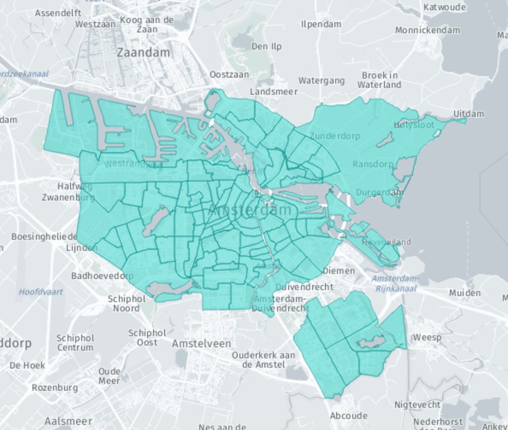
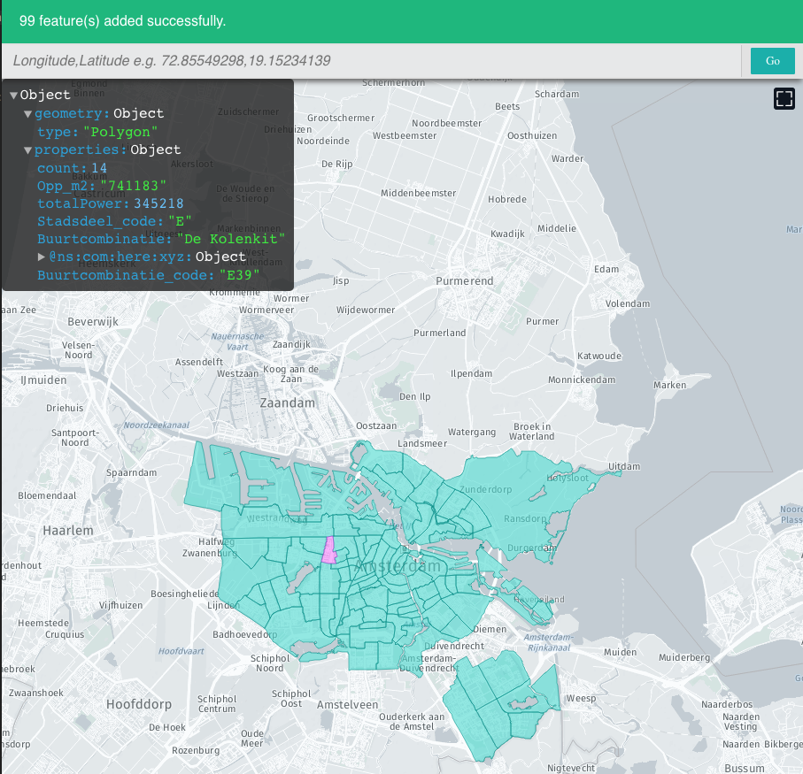
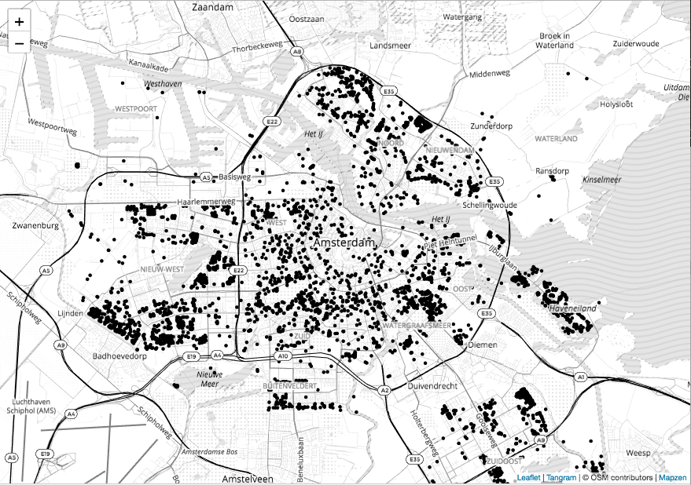

author: Stamen Design
summary: Make a map with Tangram and the XYZ API
id: Green-Amsterdam
categories: map
environments: js
status: draft
feedback link: https://github.com/here-xyz-codelabs/here-xyz-codelabs.github.io/issues
analytics account: 0

# Make a map with Tangram and the XYZ API

## Introduction

This tutorial shows you how to create a Tangram map using data from XYZ Spaces. Tangram can display vector data and handle many more points than Leaflet alone.

### What you'll learn
* The basics of managing multiple XYZ spaces
* The fundamentals of using tiled data
* How to view your data in Tangram, using the tiled data endpoint
* How to query data from XYZ using bounding box queries.

### Prerequisites
* Basic familiarity with the command line
* Basic familiarity with JavaScript

In this demo we'll download several public datasets for the city of Amsterdam and combine them in various ways in an interactive map.


## Get the data
Duration: 10:00

In this demo, we'll use open data provided by the City of Amsterdam. We'll look at two sources of data: solar panel installations, and street trees.

The solar data is available [to download](https://maps.amsterdam.nl/open_geodata/geojson.php?KAARTLAAG=ZONNEPANELEN2017&THEMA=zonnepanelen), but the default visualization of the data is not particularly informative.


Let's also download [some tree data](https://maps.amsterdam.nl/open_geodata/geojson.php?KAARTLAAG=BOMEN&THEMA=bomen1) and upload both to an XYZ space.

```
here xyz upload -f ZONNEPANELEN2017.json [SpaceID]
here xyz upload -f BOMEN.json [SpaceID]
```

To make the solar panel data more interpretable, let's try aggregating solar installations at the neighborhood level. To do so, we'll also need a [dataset of Amsterdam neighborhood boundaries](https://maps.amsterdam.nl/open_geodata/geojson.php?KAARTLAAG=GEBIED_BUURTCOMBINATIES_EXWATER&THEMA=gebiedsindeling).



## Preprocessing
Duration: 10:00

We’ll write a node script to find the total solar power generated in each neighborhood and save it to a new GeoJSON file, using [turf](http://turfjs.org/).

```
    const fs = require('fs');
    const turf = require('@turf/turf');
    
    const NEIGHBORHOODS_FILE = './GEBIED_BUURTCOMBINATIES_EXWATER.json';
    const SOLAR_FILE = './ZONNEPANELEN2017.json';
    const OUT_FILE = './heatmap.json';
    
    var nhoods = JSON.parse(fs.readFileSync(NEIGHBORHOODS_FILE, {encoding: 'utf8'}));
    var solar = JSON.parse(fs.readFileSync(SOLAR_FILE, {encoding: 'utf8'}));
    
    nhoods.features.forEach(function(feature) {
        // get list of solar panels within neighborhood polygon
        var points = turf.pointsWithinPolygon(solar, feature)

        // add total number of panels as property to neighborhood
        feature.properties.count = points.features.length;

        // add total power generated as property to neighborhood
        feature.properties.totalPower = 0;
        points.features.forEach(function(point) {
            feature.properties.totalPower += +point.properties.Vermogen;
        });
    });
    
    fs.writeFileSync(OUT_FILE, JSON.stringify(nhoods), {encoding: 'utf8'})
    
```

After installing turf with `npm install @turf/turf`, we can run this preprocessing script with `node process.js`, which will generate a file named `heatmap.json`. Finally, let's upload this to an XYZ space.

```
here xyz upload -f heatmap.json [SpaceID]
```



## View the tiled data in Tangram
Duration: 10:00

The XYZ API supports _tiling_ vector data, which lets us only load the data in chunks so that we only get the data that we need to display at that moment. To use this tiled endpoint, we need a map client that supports tiling. We'll use [Tangram](https://github.com/tangrams/tangram), an open-source WebGL based map viewer.

First, we’ll create a boilerplate Tangram map, just like [we did with Leaflet](https://here-xyz-codelabs.github.io/Air-Quality-In-Madrid/#0). The HTML for our map looks like this. Notice that we are creating a Leaflet map in much the same way as we did previously, but we are adding a _Tangram_ layer to it.

Positive
: Note: This code snippet includes a bunch of CSS that we will use later. We won't explain most of it in this tutorial. If you're curious about CSS, there are tons of resources online to learn more.

```
<!doctype html>
<html lang="en-us">
  <head>
    <meta charset="utf-8">
    <meta http-equiv="Content-Type" content="text/html; charset=utf-8">
    <meta name="viewport" content="width=device-width, initial-scale=1.0, maximum-scale=1.0, user-scalable=no">
    <title>Amsterdam Solar Energy</title>
    <link rel="stylesheet" href="https://unpkg.com/leaflet@1.3.3/dist/leaflet.css" />
    <link rel="stylesheet" href="leaflet-areaselect.css" />

    <style>
        body {
            margin: 0px;
            border: 0px;
            padding: 0px;
            font-family: Helvetica, Arial, sans-serif;
        }
        .container {
            top: 0;
            left: 0;
            right: 0;
            bottom: 0;
            position: absolute;
        }
        #map {
            height: 100%;
            width: 100%;
        }
        #controls {
            position: absolute;
            left: 1em;
            top: 100px;
            z-index: 1000;
            background-color: rgba(200, 200, 200, 0.75);
            /* display: none; */
            width: 200px;
            height: 230px;
            border-radius: 6px;
        }
        #controls div {
            margin: 16px;
            padding: 0.5em;
            background-color: hsl(204, 100%, 72%);
            border: 1px solid black;
            border-radius: 3px;
            color: black;
            box-shadow: 2px 2px 2px black;
        }
        #controls div.off {
            background-color: hsl(204, 50%, 72%);
            color: gray;
        }
        #controls div:hover {
            background-color: dodgerblue;
            margin-top: 16px;
            margin-bottom: 16px;
            color: white;
            box-shadow: 4px 4px 4px black;
        }
        #controls div#counttrees {
            background-color: #228800;
            color: white;
        }
        #controls div#counttrees:hover {
            background-color: #44AA00;
            box-shadow: 4px 4px 4px black;
        }
    </style>
  </head>

  <body>
    <div class="container">
        <div id="map"></div>
    </div>


    <!-- leaflet -->
    <script src="https://unpkg.com/leaflet@1.3.3/dist/leaflet.js"></script>

    <!-- Main tangram library -->
    <script src="https://unpkg.com/tangram/dist/tangram.min.js"></script>

    <!-- Demo setup -->
    <script>
        var map = L.map('map', {boxZoom: false});
        var layer = Tangram.leafletLayer({
            scene: 'scene.yaml',
            attribution: '<a href="https://mapzen.com/tangram" target="_blank">Tangram</a> | &copy; OSM contributors | <a href="https://mapzen.com/" target="_blank">Mapzen</a>'
        });
        layer.addTo(map);
        // center of amsterdam
        map.setView([52.372548, 4.893920], 12);
    </script>

  </body>
</html>
```

This Tangram layer loads and styles _vector_ data sources, which are defined in a seperate "scene" file, `scene.yaml` in this case.

To load our XYZ data on top of this Tangram map, we’ll need to add a `source` to our scene file for each dataset. The tiled endpoint has this format: `https://xyz.api.here.com/hub/spaces/[SpaceID]/tile/web/{z}_{x}_{y}`.

```
sources:
    solar:
        url: https://xyz.api.here.com/hub/spaces/[SpaceID1]/tile/web/{z}_{x}_{y}
        url_params:
            access_token: [AccessToken]
            clip: true
        type: GeoJSON
    neighborhoods:
        url: https://xyz.api.here.com/hub/spaces/[SpaceID2]/tile/web/{z}_{x}_{y}
        url_params:
            access_token: [AccessToken]
            clip: true
        type: GeoJSON
    trees:
        url: https://xyz.api.here.com/hub/spaces/[SpaceID3]/tile/web/{z}_{x}_{y}
        url_params:
            access_token: [AccessToken]
            clip: true
        type: GeoJSON
```

Let's draw the solar data by adding a new layer to `scene.yaml`:

```
layers:
    _solar:
        data: {source: solar}
        enabled: true
        _all:
            draw:
                points:
                    collide: false
                    color: "#000000"
                    size: 5
```

Putting the HTML file and `scene.yaml` in the same folder lets us open up our [basic map](https://stamen.github.io/here-xyz-demo/solar-tangram/index-step1.html)!

 

## Style the data
Duration: 10:00

The basic map shows our data, but it doesn't visualize it. Let's define some of the layer styles so that the data drives the visualization.

1. We can change the definition of the `_solar` style so that the size and color of the points reflect the amount of power that each solar panel produces. This replaces the simple style that we defined in the previous step.

```
    _solar:
        data: {source: solar}
        enabled: true
        _all:
            draw:
                points:
                    collide: false
                    color: |
                        function() {
                            if (feature.Functie == 'Wonen') {
                                return '#FF5306';
                            } else {
                                return '#FFC12B';
                            }
                        }
                    size: |
                        function() {
                            var value = +feature.Vermogen;
                            var size = Math.max(value/20000, 3);

                            // If we are zoomed in very far, make the points bigger
                            if ($zoom > 13) {
                               return Math.pow(2, $zoom - 13) * size;
                            }
                            return size;
                        }
```

In this YAML file, the `size` attribute is actually a Javascript function! It is capable of accessing properties in the GeoJSON feature ("vermogen" is Dutch for "capacity") and of the current map view (`$zoom`.) The value returned by the function is the size of the point.

2. Let's take advantage of our preprocessed neighborhood boundaries, and draw neighborhoods as a chloropleth based on total power generated.

```
    _neighborhoods:
        enabled: true
        data: {source: neighborhoods}
        draw:
            polygons:
                interactive: true
                order: global.sdk_order_under_water_0
                color: |
                    function() {
                        var value = feature.totalPower;
                        var color = value >= 1267538 ? "rgba(127, 0, 0, 0.5)" :
                                    value >= 1140784.2 ? "rgba(167, 4, 3, 0.5)" :
                                    value >= 1014030.4 ? "rgba(200, 29, 19, 0.5)" :
                                    value >= 887276.6 ? "rgba(224, 69, 48, 0.5)" :
                                    value >= 760522.8 ? "rgba(241, 108, 73, 0.5)" :
                                    value >= 633769 ? "rgba(250, 142, 93, 0.5)" :
                                    value >= 507015.2 ? "rgba(253, 176, 122, 0.5)" :
                                    value >= 380261.4 ? "rgba(253, 202, 148, 0.5)" :
                                    value >= 253507.6 ? "rgba(253, 220, 175, 0.5)" :
                                    value >= 126753.8 ? "rgba(254, 235, 207, 0.5)" :
                                    "rgba(255, 247, 236, 0.3)";

                        return color

                    }
            lines:
                interactive: true
                order: global.sdk_order_under_roads_0
                color: black
                width: 3px
```

Notice that instead of drawing `points:`, we are now drawing `polygons` and `lines`. Here we use the Tangram `order` property so that the neighborhood boundaries show up underneath roads and water features on the map.

3. Draw trees with a variable size based on tree trunk diameter.

```
    _trees:
        enabled: true
        data: {source: trees}
        draw: 
            points:
                collide: false
                color: '#00A000'
                size: |
                    function() {
                        var value = feature.Stamdiameter;
                        var size = value == "0 - 10 cm" ? 1.5 :
                                   value == "11 - 20 cm" ? 2 :
                                   value == "21 - 30 cm" ? 2.5 :
                                   value == "31 - 50 cm" ? 3.25 :
                                   value == "51 - 75 cm" ? 4 :
                                   value == "76 - 100 cm" ? 5 :
                                   1.5;

                        if ($zoom > 13) {
                            return Math.pow(1.5, $zoom - 13) * size;
                        }

                        return size;
                    }
```

Let's add these new style definitions to `scene.yaml` and take a look. [Now the map is starting to visualize the data.](https://stamen.github.io/here-xyz-demo/solar-tangram/index-step2.html)


## Adding pop-ups

In this step, we'll add a popup that displays the total power generated in a neighborhood when the user hovers over a neighborhood polygon. To do this, we'll change the Tangram layer definition to include a `hover` event.

```
var layer = Tangram.leafletLayer({
    scene: 'scene.yaml',
    attribution: '<a href="https://mapzen.com/tangram" target="_blank">Tangram</a> | &copy; OSM contributors | <a href="https://mapzen.com/" target="_blank">Mapzen</a>',
    events: {
        hover: function(selection) {
            if (mode === 'solar') {
                if (selection.feature) {
                    showPopup(selection.leaflet_event.latlng, selection.feature.properties.Buurtcombinatie, selection.feature.properties.totalPower);
                } else {
                    map.closePopup();
                }
            }
        }
    }
});
```

This hover event calls a function that creates a Leaflet popup at the appropriate place on the map. We'll add the name of the neighborhood and format the numbers so they look nice. This code block can be added to the `index.html` file directly below the `map` definition.

```
function formatNumber(x) {
    return x.toString().replace(/\B(?=(\d{3})+(?!\d))/g, ",");
}
// popups
var popup = L.popup({closeButton: false});

function showPopup(latlng, name, power) {
    popup
        .setLatLng(latlng)
        .setContent('<p><strong>Neighborhood:</strong> ' + name + '</p><p>Total Power: ' + formatNumber(power) + ' kW</p>')
        .openOn(map);
}
```

## Filter the data using a bounding box query
Duration: 5:00

It could still use a little more interactivity though. 

Let’s give the user the ability to draw a rectangle on the screen, and then use this as a bounding box query to the XYZ API. We’re going to use a Leaflet extension called [Leaflet-AreaSelect](https://github.com/heyman/leaflet-areaselect/), which provides a nice user interface for drawing a bounding box. Then we trigger a query to the XYZ API’s `bbox` endpoint. This XYZ API call takes two latitude and longitude parameters and returns only the points in a space that fall within that bounding box:

`'https://xyz.api.here.com/hub/spaces/[SpaceID]/bbox?access_token=[AccessToken]&west=' + west + '&south=' + south + '&east=' + east + '&north=' + north;`

To calculate the street trees within a particular bounding box, we simply have to get the bounds from `Leaflet-AreaSelect`, make the API call, and count the number of features returned. 

```
var bounds = this.getBounds();
var url = 'https://xyz.api.here.com/hub/spaces/[SpaceID]/bbox?access_token=[AccessToken]&west=' + bounds.getWest() + '&south=' + bounds.getSouth() + '&east=' + bounds.getEast() + '&north=' + bounds.getNorth();

fetch(url).then((response) => response.json()).then(function(data) {
    var len = data.features.length;
    // display a nice popup
    L.popup().setLatLng(map.getCenter()).setContent(formatNumber(len) + ' trees selected').openOn(map);
});
```

We won't add this to our code yet though, because we need some way to trigger the `Leaflet-AreaSelect` first. In the final step, we'll put everything together.

## Putting it all together
Duration: 10:00

Finally, we'll add some user interface controls for turning layers off and on. Add the following block to `index.html` just above the `<div id="container">` block.

```
<div id="controls">
    <div id="solar" class="on" onclick="toggle('solar')">Solar installations</div>
    <div id="neighborhoods" class="on" onclick="toggle('neighborhoods')">Neighborhoods</div>
    <div id="trees" class="off" onclick="toggle('trees')">Trees</div>
    <div id="counttrees" class="off" onclick="countTrees()">Count trees</div>
</div>
```

These buttons will trigger a Javascript function that toggles each layer off and on. Add the remainder of the Javascript to the end of the `<script>` block in `index.html`.

```
var mode = 'solar';

function toggle(layerName) {
    layer.scene.config.layers["_" + layerName].enabled = !layer.scene.config.layers["_" + layerName].enabled;
    document.getElementById(layerName).className = layer.scene.config.layers["_" + layerName].enabled ? "on" : "off";
    layer.scene.updateConfig();
}
```

The "count trees" button will trigger a function that adds the bounding box selector to the map and triggers the bounding box query we prototyped earlier.

```
function countTrees() {
    if (mode === 'trees') {
        areaSelect.remove(); d
        mode = 'solar';
    } else {
        mode = 'trees';
        areaSelect = L.areaSelect({width:200, height:300}); // Need to make a new one each time for some reason
        areaSelect.addTo(map);
        function calcArea(bounds) {
            if (mode == 'trees') { // Prevent this from accidentally running in the other mode
                map.spin(true);
                var url = 'https://xyz.api.here.com/hub/spaces/ZXKLXJZ4/bbox?access_token=AQAd6lqjXCQJrGMMkvbUItM&west=' + bounds.getWest() + '&south=' + bounds.getSouth() + '&east=' + bounds.getEast() + '&north=' + bounds.getNorth();
                fetch(url).then((response) => response.json()).then(function(data) {
                    var len = data.features.length;
                    map.spin(false);
                    L.popup().setLatLng(map.getCenter()).setContent(formatNumber(len) + ' trees selected').openOn(map);
                });
            }
        };
        calcArea(areaSelect.getBounds()); // Run it once at load time
        areaSelect.on("change", function() {
            calcArea(this.getBounds());  // Then run it again anytime the box changes
        });
    }
}
```

And that's our [final map](https://stamen.github.io/here-xyz-demo/solar-tangram/)!


